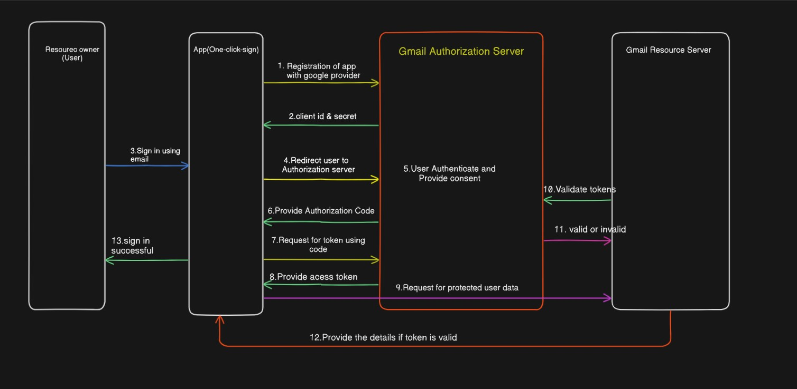

# OneClickSign

Implement OAuth2 authentication flow from scratch without using OAuth libraries.
## 📚 Table of Contents
- [Overview](#overview)
- [Architecture](#architecture)
- [Installation & Setup](#installation--setup)
- [Configuration](#configuration)
- [Deployment](#deployment)
- [Security Considerations](#security-considerations)
- [API Reference](#api-reference)
- [Testing](#testing)
- [Troubleshooting](#troubleshooting)
- [Contributing](#contributing)
- [License](#license)

## 🔍 Overview

**OneClickSign** is a production-grade authentication system implementing the **OAuth2 Authorization Code Flow** with **Google** as the identity provider.

### ✅ Key Features
- **OAuth2 Compliance:** Implements [RFC 6749](https://datatracker.ietf.org/doc/html/rfc6749) standards
- **Session Security:** State parameter validation for CSRF protection
- **User Data Management:** Retrieves and displays profile info (name, email, picture)
- **HTTPS Ready:** Secure for production environments

## 🏗️ Architecture


### 🧩 Components


| Component       | Technology     | Responsibility                           |
|----------------|----------------|------------------------------------------|
| Frontend       | Thymeleaf      | Render HTML templates                    |
| Backend        | Spring Boot 3.x| Handle OAuth2 flow, session management   |
| Session Storage| HTTP Session   | Store user authentication state          |
| OAuth Provider | Google Identity| User authentication & authorization      |
| Deployment     | Railway        | Cloud hosting with auto-scaling          |


### 📊 System Diagram




### [View Architecture Diagram](https://app.eraser.io/workspace/DbPy8y9iF0mpGoJ2Gfmm?origin=share)

## ⚙️ oneclicksign – OAuth2 Login Application

### 🔧 Prerequisites
- **Java Development Kit (JDK)** 21+- **Apache Maven** 3.9+
- **Google Cloud Platform Account**

---

## 🚀 Local Setup

```bash
# Clone repository
git clone https://github.com/yourusername/oneclicksign.git
cd oneclicksign

# Build application
mvn clean package

# Run locally
java -jar target/oneclicksign.jar
```

### 🛠️ Configuration
#### 🌐 Google OAuth Setup

Create OAuth 2.0 credentials via Google Cloud Console.
```base
Set authorized domains:

railway.app  
your-domain.com

```
#### 🔐 Environment Variables
```base
google.client.id=${GOOGLE_CLIENT_ID}
google.client.secret=${GOOGLE_CLIENT_SECRET}
google.redirect.uri=${APP_URL}/callback
google.scope=openid profile email
```
## 📬 API Reference

### 🔗 Endpoints

| Endpoint     | Method | Parameters              | Description                                                                 |
|--------------|--------|--------------------------|-----------------------------------------------------------------------------|
| `/login`     | GET    | –                        | Generates and returns a Google OAuth2 login URL with required query params. Frontend should redirect the user to this URL. |
| `/callback`  | GET    | `code`, `state`, `error` | Handles the OAuth2 callback from Google. Exchanges authorization code for access token and fetches user info. |
| `/profile`   | GET    | –                        | Displays the authenticated user's profile information. Requires valid session. |
| `/logout`    | GET    | –                        | Logs out the user and terminates the session.                              |


## 🚀 Deployment

### 🧾 Railway Configuration

| Setting         | Value                                |
|-----------------|--------------------------------------|
| **Runtime**     | Java 21                              |
| **Build Command** | `mvn -B clean package`              |
| **Start Command** | `java -jar target/oneclicksign.jar` |

## 🤝 Contributing

We welcome contributions from the community!

### Steps to Contribute:

1. **Fork** the repository.
2. **Create a new branch** for your feature:
   ```bash
   git checkout -b feature/your-feature-name
   ```
3. **Follow** the [Google Java Style Guide](https://google.github.io/styleguide/javaguide.html).
4. **Add tests** and update documentation where necessary.
5. **Submit a pull request** with:
    - ✅ Tests
    - 📝 Documentation
    - 📜 CHANGELOG entry (if applicable
## License

[MIT](https://choosealicense.com/licenses/mit/)

